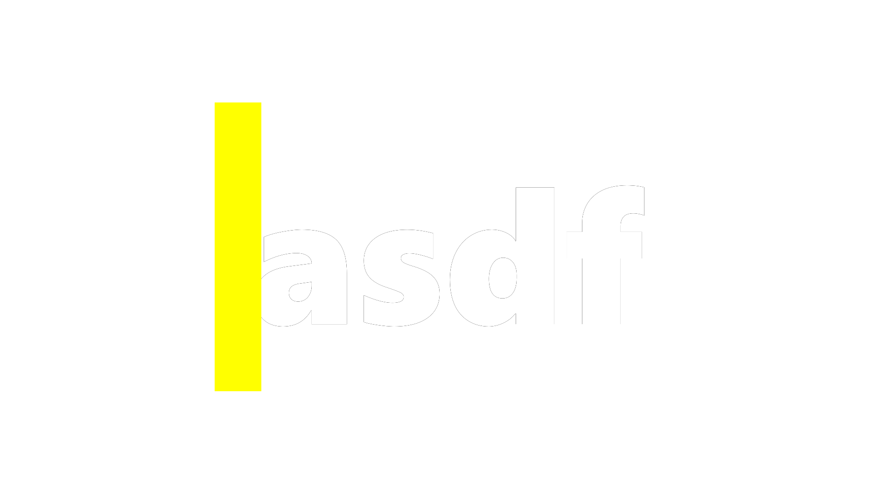

# Generate text

This example posts a single `Template` clip that generates a `text` in large title format.

!!! note "Preview time"
    Preview time at `t` seconds is a required query parameter.

=== "Edl"
    ``` json title="data.json"
    {
      "clips": [
        { 
          "type" : "template",
          "name" : "title",
          "data": {
            "text": "asdf"
          }
        }
      ]
    }
    ```

=== "Request"
    ``` bash title="Preview template at t=1"
    curl -H "Content-Type: application/json" \
      -H "Authorization: Bearer $TOKEN" \
      -d @data.json \
      https://alfred.quaternion.media/otto/preview?t=1
    ```

## Results

Returns a local url to the rendered file

```
data/20211203-221343.png
```
{ align = right, loading = lazy }
